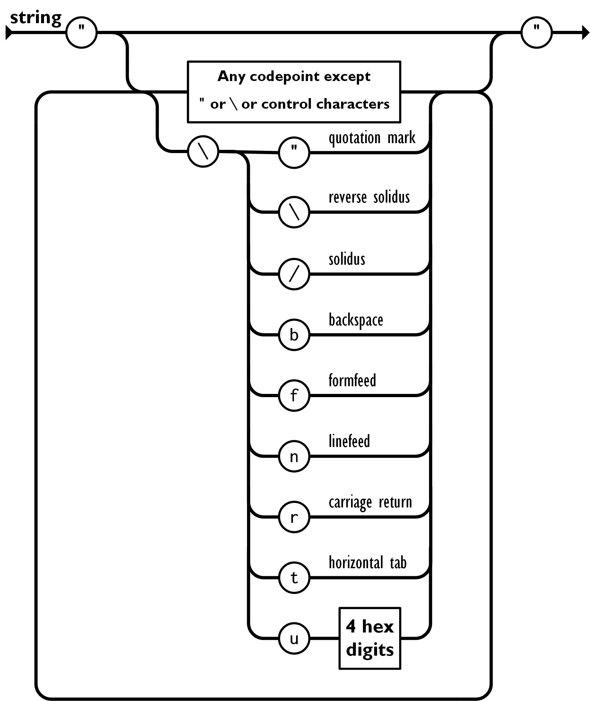
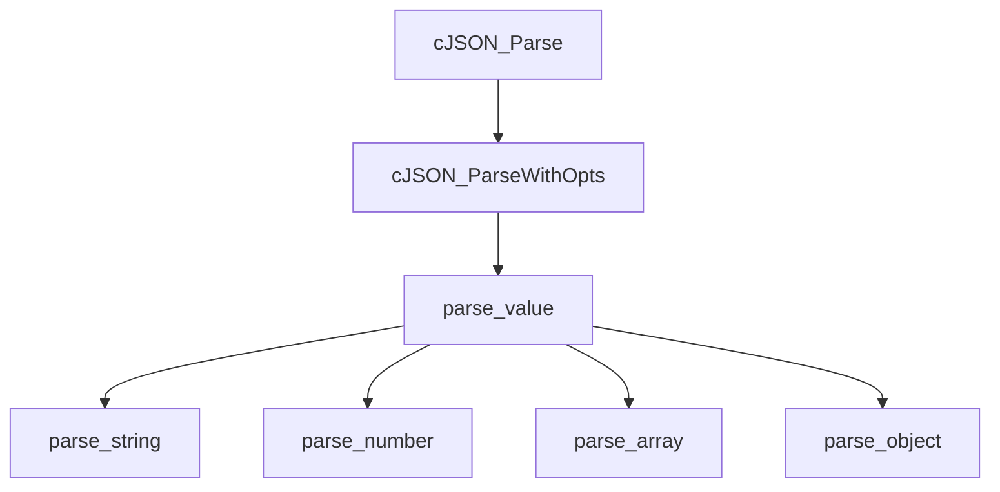
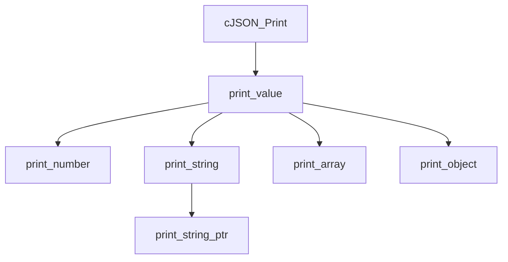

# cJSON笔记


## cJSON数据结构

- cJSON type

  ```c
  #define cJSON_False 	0
  #define cJSON_True 		1
  #define cJSON_NULL		2
  #define cJSON_Number	3
  #define cJSON_String	4
  #define cJSON_Array		5
  #define cJSON_Object 	6
  
  #define cJSON_IsReference	256
  #define cJSON_StringIsConst	512
  ```

  

- cJSON

  ```c
  typedef struct cJSON{
  	struct cJSON *next;
  	struct cJSON *prev;
  	struct cJSON *child;
  	
  	int type;
  
  	char *valuestring;
  	int valueint;
  	double valuedouble;
  
  	char *string;
  } cJSON;
  ```

  

- cJSON_Hooks

  ```c
  typedef struct cJSON_Hooks {
  	void *(*malloc_fn) (size_t sz);
  	void (*free_fn)(void *ptr);
  } cJSON_Hooks;
  ```

  

- printbuffer

  ```c
  typedef struct {
  	char *buffer;
  	int length;
  	int offset;
  } printbuffer;
  ```

  

## 主要函数功能介绍


1. 
    解析数字, 将字符串解析为数字存储在cJSON中

    ```c
    static const char* parse_number(cJSON* item, const char* num)
    ```

    
    
    
    
2. 从cJSON中把数字转为字符串, 返回字符串地址 

    ```c
    static char *print_number(cJSON* item, printbuffer *p) 
    ```

    

3. 将文本解析为未转义的cstring，然后保存在cJSON的valuestring, 解析之后返回下个未解析的地址

      ```c
      static const char *parse_string(cJSON *item, const char *str) 
      ```

     

     

5.  将提供的cstring转为可以打印的转义版本, 返回字符串地址

     ```c
     static char *print_string_ptr(const char *str, printbuffer *p)
     ```

5. 返回待打印的字符串

     ```c
     static char* print_string(cJSON* item, printbuffer *p)
     ```

     

6. 将文本解析为数组, 返回解析后的地址

     ```c
     static const char *parse_array(cJSON *item, const char *value)
     ```

     

     

7. 将cJSON中的数组转为文本, 返回打印字符串的地址

     ```c
     static char *print_array(cJSON *item, int depth, int fmt, printbuffer *p)
     ```

     

8. 解析对象, 调用parse_value完成解析

   
      ```c
      cJSON *cJSON_ParseWithOpts(const char *value, const char **return_parse_end, int require_null_terminated)
      ```
     
      
   
     

     

9. 把对象转为文本, 返回打印字符串的地址

     ```c
     static char *print_object(cJSON *item, int depth, int fmt, printbuffer *p)
     ```

10. 解析器核心-遇到文本时，进行适当处理

     ```c
     static const char *parse_value(cJSON *item, const char *value)
     ```

     

     

11. 根据cJSON的type调用对应的print函数

      ```c
      static char *print_value(cJSON *item, int depth, int fmt, printbuffer *p)
      ```

      

12. 解析代码, 通过调用cJSON_ParseWithOpts完成

      ```c
      cJSON *cJSON_Parse(const char *value)
      ```

      

13. 获取(格式化)cJSON打印文本, 通过调用print_value完成

       ```c
       char *cJSON_Print(cJSON *item)
       ```

       

       

       

## 其他函数功能介绍


```c
// 大小写不敏感, s2包含s1返回1, 其他返回非0
static int cJSON_strcasecmp(const char *s1, const char *s2) 
    
// 函数指针, cJSON_free指向malloc, 返回值为void    
static void (*cJSON_free)(void *ptr) = free;    

// 函数指针, cJSON_malloc指向malloc, 返回值为void*
static void *(*cJSON_malloc)(size_t sz) = malloc; 

// 拷贝str, 返回副本
static char* cJSON_strdup(const char* str)

// 初始化cJSON_malloc和cJSON_free
void cJSON_InitHooks(cJSON_Hooks* hooks)

// 创建一个新的cJSON对象
static cJSON *cJSON_New_Item(void)
 
// 递归删除cJSON的所有项
void cJSON_Delete(cJSON *now) 

// 返回满足needed长度的字符串地址
static char *ensure(printbuffer *p, int needed)
 
// 更新buffer的长度, 返回已经使用的长度
static int update(printbuffer *p)

// 跳过控制字符
static const char *skip(const char *in)
```


## cJSON解析




## cJSON输出



